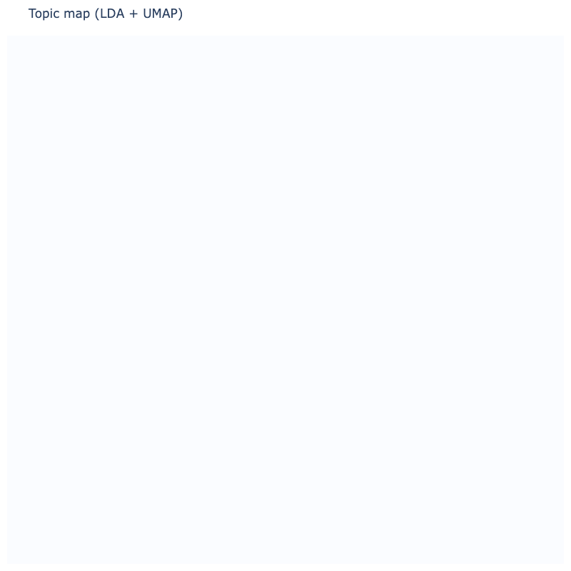

# topicviz (testing)

This is a **testing repository** for a lightweight Bunka-style topic map that works in Google Colab.

It uses:
- **LDA (scikit-learn)** for topic words / topic assignment
- **SentenceTransformer embeddings** + **UMAP** for the 2D projection
- **Plotly** for visualization (no legend)

> ⚠️ Experimental: APIs and visuals may change.

## Open in Colab

[](https://colab.research.google.com/github/palefo/topicviz/blob/main/notebooks/topicviz_colab_demo.ipynb)

## Example output



## Install

```bash
pip install git+https://github.com/palefo/topicviz
```

## Notes

- The demo uses `BAAI/bge-small-en-v1.5` for sentence embeddings.
