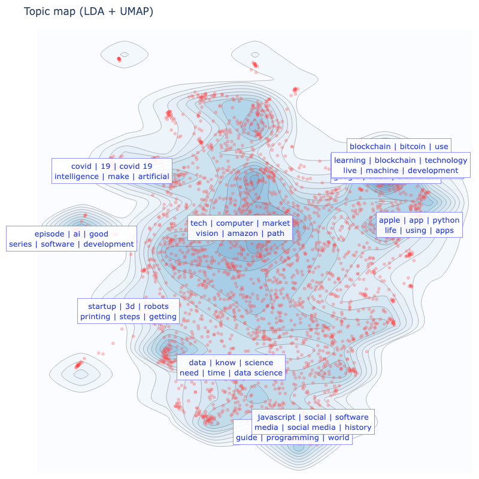

# topicviz (testing)

This is a **testing repository** for a lightweight Bunka-style topic map that works in Google Colab.

It uses:
- **LDA (scikit-learn)** for topic words / topic assignment
- **SentenceTransformer embeddings** + **UMAP** for the 2D projection
- **Plotly** for visualization (no legend)

> ⚠️ Experimental: APIs and visuals may change.

## Open in Colab

[](https://colab.research.google.com/github/palefo/topicviz/blob/main/notebooks/topicviz_colab_demo.ipynb)

## Example output



## Install

```bash
pip install git+https://github.com/palefo/topicviz
```

## Notes

- The demo uses `BAAI/bge-small-en-v1.5` for sentence embeddings.

## Interface (temporal, might change!!)

### `TopicViz(...)`

Constructor parameters:

- `n_topics` (int, default `12`): Number of LDA topics.
- `max_features` (int, default `5000`): Vocabulary size cap for the bag-of-words model.
- `stop_words` (str | None, default `"english"`): Stopword list for `CountVectorizer`.
- `random_state` (int, default `42`): Random seed for LDA/UMAP and sampling.
- `umap_n_neighbors` (int, default `15`): UMAP neighborhood size (higher = more global structure).
- `umap_min_dist` (float, default `0.1`): UMAP minimum distance (lower = tighter clusters).

### `tv.fit(docs, ...)`

Fits LDA topics and builds a 2D map.

- `docs` (Sequence[str]): Your documents (titles, sentences, etc.).
- `embedding_model` (SentenceTransformer | None): If provided, UMAP is fit on sentence embeddings (recommended).
- `embedding_batch_size` (int, default `64`): Batch size for embedding inference.
- `use_embeddings_for_projection` (bool, default `True`): If `False` or no `embedding_model`, UMAP runs on LDA doc-topic vectors.
- `topic_embedding_words` (int, default `10`): Number of top topic words joined into a “sentence” for embedding-based label anchoring.

Returns `self`.

### `tv.visualize_topics(...)`

Creates a Plotly figure.

- `width`, `height` (int): Figure size in pixels.
- `colorscale` (str): Plotly colorscale name for density contours (e.g. `"Blues"`).
- `density` (bool): Draw density contours behind points.
- `show_text` (bool): Show topic label boxes.
- `repel_labels` (bool): Apply simple label collision-avoidance (repulsion).
- `topic_label_mode` (str): `"embedding"` (default) anchors labels from embedded topic-word “sentences” projected via `UMAP.transform()`, or `"centroid"` uses document cluster centroids.
- `sample` (int | None): Randomly subsample documents for faster plotting.
- `title` (str): Figure title.
- `point_size` (int): Dot size.
- `point_color` (str): Dot color (rgba string recommended).
- `point_opacity` (float): Dot opacity.
- `label_size_ratio` (float): Larger values make label font smaller.
- `label_words` (int): Number of topic words shown in the label box.
- `label_words_per_line` (int): Words per line in the label box.
- `hover_show_topic` (bool): If `True`, hover also shows topic id + probability.
- `hover_max_chars` (int): Truncate hover text to this many characters.

Returns a Plotly `Figure`.

## Bourdieu map

`topicviz` also supports a **Bourdieu map**: a 2D semantic plane defined by two contrasting axes.  
Each document is positioned by *relative cosine similarity* to the axis poles:

- **X** = sim(doc, `x_right_words`) − sim(doc, `x_left_words`)
- **Y** = sim(doc, `y_top_words`) − sim(doc, `y_bottom_words`)

This visualization is embedding-based (SentenceTransformer recommended).

### Example

```python
from sentence_transformers import SentenceTransformer
from topicviz import TopicViz

embedding_model = SentenceTransformer("BAAI/bge-small-en-v1.5")

tv = TopicViz(n_topics=12, random_state=42).fit(docs, embedding_model=embedding_model)

fig = tv.visualize_bourdieu(
    docs=docs,  # optional if you already fit on the same docs
    embedding_model=embedding_model,
    x_left_words=["This shows high autonomy satisfaction"],
    x_right_words=["This shows low autonomy satisfaction"],
    y_top_words=["This shows high autonomy frustration"],
    y_bottom_words=["This shows low autonomy frustration"],
    radius_size=0.2,
    width=800,
    height=800,
    clustering=False,
    density=False,
    convex_hull=True,
)
fig.show()
```

Parameters (summary)
-	`x_left_words, x_right_words, y_top_words, y_bottom_words (list[str])`: Anchor phrases for each pole.
-	`radius_size (float)`: Controls marker size (roughly).
-	`clustering (bool) + n_clusters (int)`: Optional clustering in Bourdieu space.
-	`density (bool)`: Optional density contours.
-	`convex_hull (bool)`: Optional boundary around points.